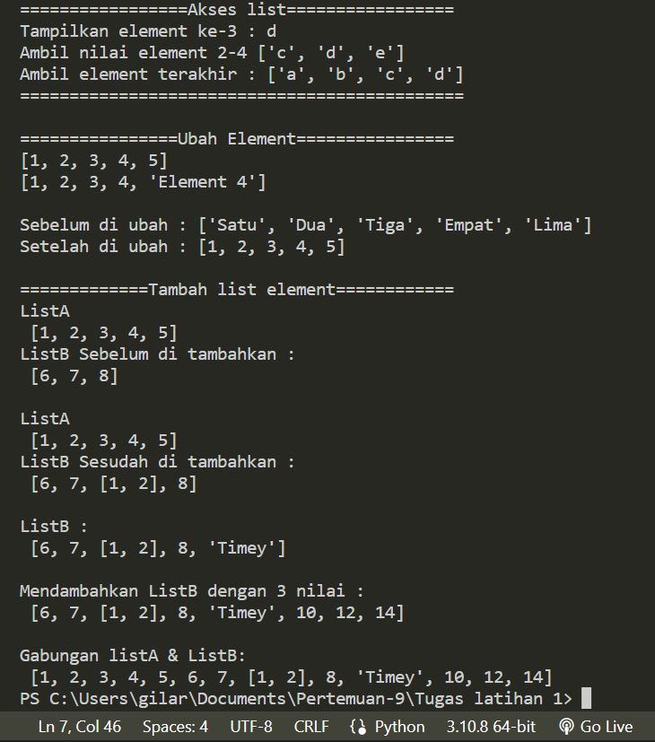

# Pertemuan-9

## Profil
| Variable | Isi |
| -------- | --- |
| **Nama** | Gilar Sumilar |
| **NIM** | 312210407 |
| **Kelas** | TI.22.A.4 |
| **Mata Kuliah** | Bahasa Pemrograman |

## List & 
### Buat sebuah list sebanyak 5 elemen dengan nilai bebas 
#### Akses list : 
- Tampilkan elemen ke 3
- Ambil nilai elemen ke 2 sampai elemen ke 4
- Ambil elemen terakhir
#### Ubah elemen list:
- Ubah elemen ke 4 dengan nilai lainnya
- Ubah elemen ke 4 sampai dengan elemen terakhir
#### Tambah elemen list:
- Ambil 2 bagian dari list pertama (A) dan jadikan list ke 2 (B)
- Tambah list B dengan nilai string
- Tambah list B dengan 3 nilai
- Gabungkan list B dengan list A

#### 1. Akses list
```Python
print("=================Akses list=================")

# Akses list
list1 = ["a", "b", "c", "d", "e"]
print("Tampilkan element ke-3 :", list1[3]) 
print("Ambil nilai element 2-4", list1[2:5])
print("Ambil element terakhir :", list1[0:4])

print( 45*"=", "\n")
```
`list = ["a", "b", "c", "d", "e", "f"]`, Membuat variable list

`print("Tampilkan element ke-3 :", list1[3])`, Menampilkan element ke 3 dari variable `list1`

`list[0:4]` Untuk menampilkan element ke-2 - 4 dari `list1`  

#### 2. Ubah element list
```Python
print("================Ubah Element================")
# Ubah element
list2 = [1, 2, 3, 4, 5]
print(list2)
list2[4] = "Element 4"
print(list2)

print()

list3 = ["Satu", "Dua", "Tiga", "Empat", "Lima"]
print("Sebelum di ubah :", list3)
list3[0:6] = [1, 2, 3, 4, 5]
print("Setelah di ubah :", list3, "\n")
```
`list2 = [1, 2, 3, 4, 5]`, Membuat variable list

`list2[4] = "Element 4"`, Mengubah list element ke-4 menjadi "Element 4"

```Python
list3 = ["Satu", "Dua", "Tiga", "Empat", "Lima"]
print("Sebelum di ubah :", list3)
list3[0:6] = [1, 2, 3, 4, 5]
print("Setelah di ubah :", list3, "\n")
```
`list3 = ["Satu", "Dua", "Tiga", "Empat", "Lima"]`, Variable `list3` sebelum di ubah

`list3[0:6] = [1, 2, 3, 4, 5]`, Ubah element 0-6 menjadi 1, 2, 3, 4, 5, 6  

#### 3. Tambah element list
```Python
print("=============Tambah list element============")
# Tambah list element
#  Index   0(-5),   1(-4),  2(-3),   3(-2),   4(-1) 
lista  = [1, 2, 3, 4, 5]
print("ListA\n", lista)
listb  = [6, 7, 8]
print("ListB Sebelum di tambahkan :\n", listb, "\n")

lista  = [1 ,2 ,3 ,4 ,5]
print("ListA\n", lista)
listb  = [6 ,7 ,8 ]
listb.insert(2, lista[0:2])  
print("ListB Sesudah di tambahkan :\n", listb, "\n")

# Mendambahkan list B dengan nilai string
listb.append("Timey")
print("ListB :\n", listb,"\n")

# Menambahkan list B dengan 3 Nilai
listb.extend([10, 12, 14])
print("Mendambahkan ListB dengan 3 nilai :\n", listb,"\n")
# Menggabungkan ListA dan ListB 
listN = lista + listb
print("Gabungan listA & ListB: \n", listN)
```
`Index   0(-5),   1(-4),  2(-3),   3(-2),   4(-1)`, Sebagai tanda, contoh 4(-1) adalah element ke-4 dari lista

`listb.insert(2, lista[0:2])`, Masukan element `lista = [1, 2] setelah 6, 7

`listb.append("Timey")`, Menambahkan `listb` dengan nilai string `"Timey"`

`listN = listA + listb`, Menggabungkan `lista` & `listb` dengan membuat list baru `listN`

## Hasil program 


